```mermaid
graph LR

%% ====== Application Layer ======
    subgraph APP[Application Layer]
        Java[Java 17]:::app
        Spring[Spring Boot 3.5.3]:::app
        Java --> Spring
    end

%% ====== Data Layer ======
    subgraph DATA[Data Layer]
        MySQL[(MySQL 8.0)]:::data
        Redis[(Redis)]:::data
    end

%% ====== Messaging Layer ======
    subgraph MSG[Messaging Layer]
        Outbox[(Outbox Table)]:::msg
        Worker[Outbox Worker]:::msg
        Kafka[(Kafka Cluster)]:::msg
        Outbox --> Worker --> Kafka
    end

%% ====== Infrastructure Layer ======
    subgraph INFRA[Infrastructure]
        Docker[Docker Engine]:::infra
        Compose[Docker Compose]:::infra
        EC2[AWS EC2]:::infra
        Docker --> Compose
    end

%% ====== Testing Layer ======
    subgraph TEST[Testing]
        JMeter[JMeter Load Test]:::test
    end

%% ====== Flow (그대로 유지) ======
    Spring --> MySQL
    Spring --> Redis
    Spring --> Outbox
    Spring --> Kafka
    JMeter --> EC2
    EC2 --> Spring

%% ====== STYLE DEFINITIONS ======
    classDef app fill:#FFF5CC,stroke:#E0C060,stroke-width:1px,color:#5A4B00;
    classDef data fill:#E7F3FF,stroke:#7CB2F4,stroke-width:1px,color:#003366;
    classDef msg fill:#FDE2E1,stroke:#E59A92,stroke-width:1px,color:#5A0000;
    classDef infra fill:#F2F0FF,stroke:#B7A8FF,stroke-width:1px,color:#2E1A47;
    classDef test fill:#E5FFE8,stroke:#8DD999,stroke-width:1px,color:#004D1A;

%% subgraph ìŠ¤íƒ€ì¼ (ID 기반)
    style APP fill:#FFFAE6,stroke:#D5C385,stroke-width:1.5px;
    style DATA fill:#F2F8FF,stroke:#8EBBEA,stroke-width:1.5px;
    style MSG fill:#FFF0F0,stroke:#E8A4A0,stroke-width:1.5px;
    style INFRA fill:#F8F6FF,stroke:#CABFFF,stroke-width:1.5px;
    style TEST fill:#F2FFF4,stroke:#

```

# 🤍 이벤트 커머스 시스템 

대규모 트래픽 환경에서 **선착순 쿠폰 발급 → 이벤트 시작 → 재고 한정 특가 구매 →  결제 → 굿즈 제공**까지 이어지는 이벤트형 커머스를 설계·구현한 프로젝트입니다.

## 프로젝트 목표
- 순간 트래픽을 안정적으로 처리할 수 있는 커머스 시스템 구축
- 선착순/재고 경쟁 상황의 대규모 동시성 이슈 해결

## 주요 구현 및 해결 과제
- Redis Lua Script 기반 재고관리
  - Race Condition 방지 및 원자적 처리 보장
- Kafka 기반 비동기 처리 구조
  - 주문/결제 요청의 비동기 처리 아키텍처 설계
- Docker 기반 컨테이너 환경 구축
  - 개발 및 배포 환경 일관성 확보
- Redis Key Expiration Listener + 스케줄러 기반 이벤트 관리
  - 이벤트 자동 오픈 처리 
  - 리스너 미수신, 재시작 등 예외 상황에 대비한 스케줄러 기반 복구 처리 

  
## 사용 기술
- **Language**: Java 17
- **Framework**: Spring Boot 3.5.3
- **Database**: MySQL 8.0
- **Cache**: Redis
- **Messaging & Async Processing** Queue : Kafka + Outbox Pattern
- **Infra**: Docker / Docker Compose, AWS EC2
- **Load Test**: JMeter

## 시스템 아키텍처

### 🔍 Architecture 상세 문서 → [Architecture 문서](docs/architecture.md)

### 📈 전체 Sequence Diagram
- [쿠폰 발급](docs/sequence/coupon.md)
- [주문 생성](docs/sequence/order.md)
- [결제 승인](docs/sequence/payment.md)
- [이벤트 시작](docs/sequence/event.md)  