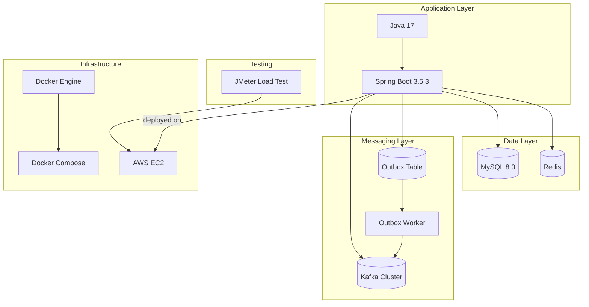

# ✨ architecture.md (주요 흐름) ✨

# 쿠폰
쿠폰 발급은 Redis Lua 스크립트를 사용하여 재고 차감과 사용자 발급 상태 저장을 원자적으로 처리하여 동시성 문제를 해결합니다.
## 쿠폰 발급

```
Client → API → Redis(Lua) → Kafka → Consumer: DB
```

1. DB 쿠폰 정보 조회
   - 쿠폰 존재 여부 확인
   - 만료 여부 확인
2. Redis 캐시 확인
   - Redis에 쿠폰 재고 정보 없으면 DB → Redis 캐싱
3. Redis Lua스크립트로 원자적 처리
   - 쿠폰 확인
   - 재고 차감
   - 사용자 발급 상태 저장
   - 중복 발급 방지
5. Kafka 발행 : `COUPON_ISSUED`
6. Kafka Consumer
   - coupon_issue 테이블 저장
   - 실패 시 4회 재시도

---

# 주문

## 주문 요청 
```
Client → API → DB → Redis(Lua)
```
1. 상품 유효성 검증 (DB)
2. 주문 저장 (order)
3. 배송정보 저장 (shipping_info)
4. Redis Lua로 재고 예약
   - 재고 차감
   - hold TTL 설정 (10분)
5. 주문 생성 후 오류 발생 시 : Redis 재고 예약 롤백 
    

---

# 결제
결제는 **준비(Prepare)** 와 **승인(Approve)** 2단계로 나뉘며, 승인 단계에서는 트랜잭션과 Outbox 패턴을 사용해 주문 상태 업데이트와 재고 차감 이벤트 발행을 처리합니다.

결제 준비 → 결제 승인 flow 는 클라이언트에서 PG를 통한 결제처리를 가정합니다.

## 1. 결제 준비
```
Client → API → DB 
```
1. 주문 조회 및 검증
   - 결제 가능 상태, 주문자 - 결제자 일치 여부 등
   - 금액 검증
3. 주문 상태 변경 : `CREATED` -> `PENDING_PAYMENT`
4. 결제 테이블 저장 : `PENDING`


## 2. 결제 승인
```
Client → API → PG 승인 → Outbox → Kafka → Consumer: DB, Redis
```
1. 주문 조회
2. 상태 검증 : 이미 PAID → 멱등 처리
3. 결제 정보 검증  
4. PG 결제 승인 (naverpay approve)
5. 결제 후 처리
   1. 성공
       - Payment 상태 업데이트 : PAID
       - Order 상태 업데이트 : PAID
       - PaymentAttempt 기록
       - Outbox 저장 : `ORDER_PLACED`
   2. 실패
      - PaymentAttempt 기록
6. Kafka 발행 : `ORDER_PLACED`
7. Kafka Consumer
   - DB 재고 차감
   - ProductStockAudit 기록
   - Redis 재고확정
   - 실패 시 3회 재시도

---
# 이벤트 스케줄링
이벤트 시작 시간 관리에 **Redis zset**을 활용하고, Redis Key 만료 이벤트와 분산 락을 결합하여 이벤트 시작을 처리합니다.

###  이벤트 예약
```
Client → API → Redis  
```
1. Redis에 이벤트 pending 상태로 저장
2. zset에 스케줄 키 저장

### 이벤트 시작
```
RedisKeyExpirationListener → Redis → Outbox -> Kafka → Consumer: SSE
```
1. RedisKeyExpirationListener가 키 만료 이벤트 수신
2. 분산 락 획득
   1. 이벤트 상태 : open ->  멱등 처리
   2. 이벤트 상태 : pending 
       - 이벤트 상태 open으로 변경
       - outbox 저장 : `EVENT_OPEN`
5. 스케줄 키 삭제 
6. 락 해제


### 이벤트 시작 유실 보완
`EventRecoveryScheduler`
- 1분마다 실행되는 별도의 스케줄러
- pending 상태 이벤트 조회 후 DB 상태가 open이 아니면 강제 open 처리하여 이벤트 시작 유실을 보완

---

# Outbox
Outbox 패턴을 활용하여 DB 트랜잭션과 비동기 메시지 발행의 이중 쓰기 문제를 해결하고 Kafka를 통해 신뢰성 있는 메시지 전달을 보장합니다.
###  Worker

- 실행 주기 : 5초마다 실행
- 실패 시 Exponential Backoff 적용하여 재시도

### 주요 Outbox 종류
- `ORDER_PLACED` 
  - 결제 완료 후 재고 확정 처리
  - Kafka: `ORDER_PLACED` 발행

- `EVENT_OPEN` 
  - 이벤트 시작 후 실시간 알림 전ㅍ파
  - Kafka: `EVENT_OPEN` 발행 (이벤트 시작 알림, SSE 전파 등)

---

# Kafka Consumer 처리
각 이벤트에 대한 비즈니스 로직을 수행하며 재시도 메커니즘을 통해 신뢰성을 확보합니다.

### ORDER_PLACED
1. 재시도 3회
2. 재고 확정 트랜잭션
    - DB 재고 차감
   - ProductStockAudit 기록
   - Redis 재고확정

### EVENT_OPEN
- 이벤트 시작을 SSE를 통해 실시간 사용자 알림(push)

