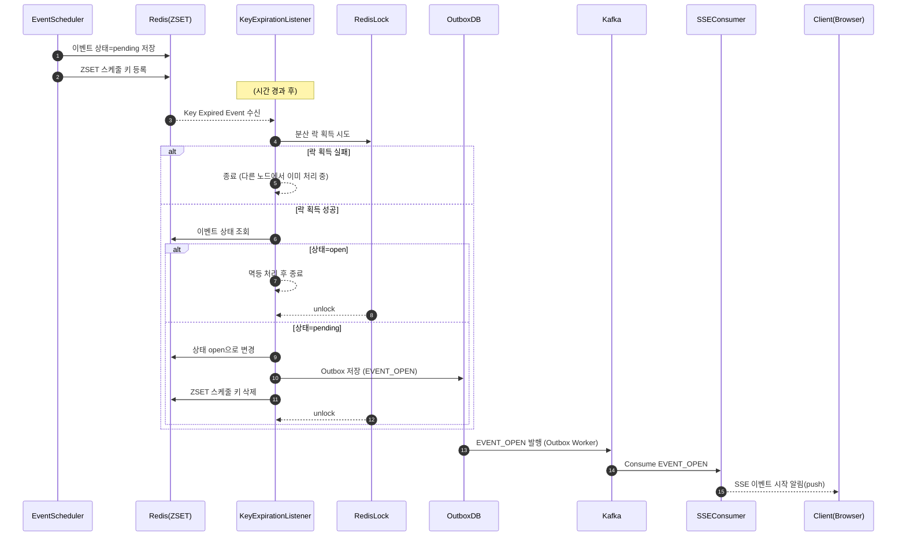

### 이벤트 시작
```
RedisKeyExpirationListener → Redis → Outbox -> Kafka → Consumer: SSE
```
1. RedisKeyExpirationListener가 키 만료 이벤트 수신
2. 분산 락 획득
    1. 이벤트 상태 : open ->  멱등 처리
    2. 이벤트 상태 : pending
        - 이벤트 상태 open으로 변경
        - outbox 저장 : `EVENT_OPEN`
5. 스케줄 키 삭제
6. 락 해제



