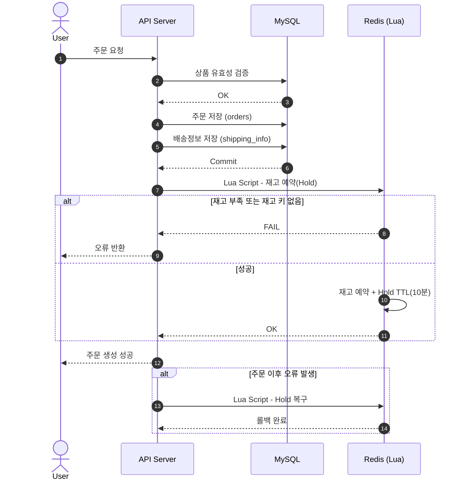

# 📦 주문 생성 

DB에 주문/배송 정보를 저장한 후  
Redis Lua Script로 재고 예약(Hold)을 수행하는 구조입니다.

---

## 📈 Sequence Diagram

```mermaid
sequenceDiagram
    autonumber
    actor User
    participant API as API Server
    participant DB as MySQL
    participant Redis as Redis (Lua)

    User->>API: 주문 요청

    API->>DB: 상품 유효성 검증
    DB-->>API: OK

    API->>DB: 주문 저장 (orders)
    API->>DB: 배송정보 저장 (shipping_info)
    DB-->>API: Commit

    API->>Redis: Lua Script - 재고 예약(Hold)
    alt 재고 부족 또는 재고 키 없음
        Redis-->>API: FAIL
        API-->>User: 오류 반환
    else 성공
        Redis->>Redis: 재고 예약 + Hold TTL(10분)
        Redis-->>API: OK
    end

    API-->>User: 주문 생성 성공

    alt 주문 이후 오류 발생
        API->>Redis: Lua Script - Hold 복구
        Redis-->>API: 롤백 완료
    end
```
