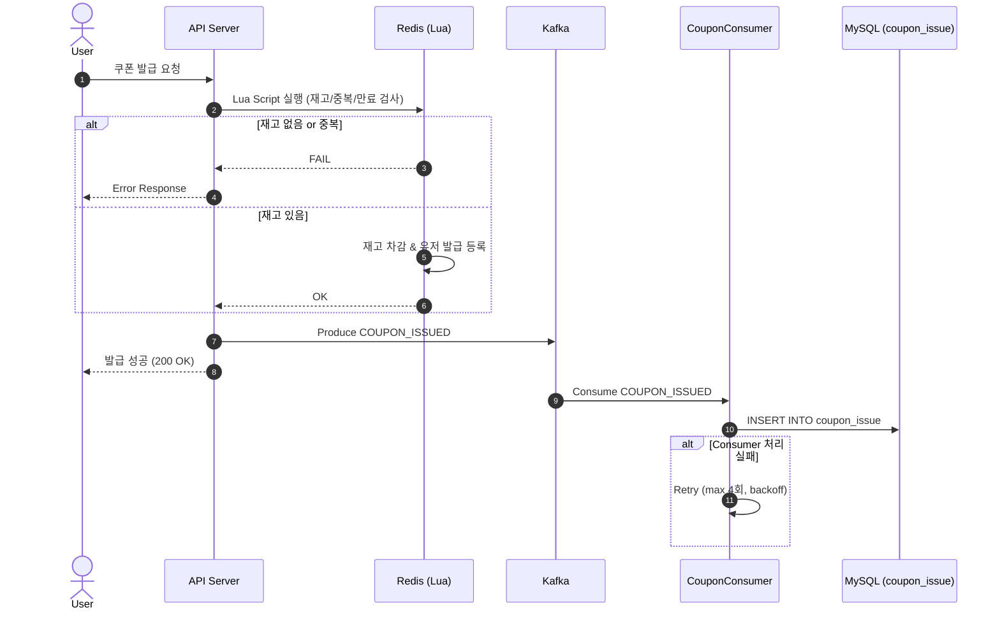

# 🎟️ 쿠폰 발급
Redis Lua Script 기반으로 재고/중복/만료를 원자적으로 처리하고,  
Kafka를 통해 비동기로 DB 저장을 수행하는 구조입니다.

---

## 📈 Sequence Diagram

```mermaid
sequenceDiagram
    autonumber
    actor User
    participant API as API Server
    participant Redis as Redis (Lua)
    participant Kafka as Kafka
    participant Consumer as CouponConsumer
    participant DB as MySQL (coupon_issue)

    User->>API: 쿠폰 발급 요청

    API->>Redis: Lua Script 실행 (재고/중복/만료 검사)
    alt 재고 없음 or 중복
        Redis-->>API: FAIL
        API-->>User: Error Response
    else 재고 있음
        Redis->>Redis: 재고 차감 & 유저 발급 등록
        Redis-->>API: OK
    end

    API->>Kafka: Produce COUPON_ISSUED
    API-->>User: 발급 성공 (200 OK)

    Kafka->>Consumer: Consume COUPON_ISSUED
    Consumer->>DB: INSERT INTO coupon_issue

    alt Consumer 처리 실패
        Consumer->>Consumer: Retry (max 4회, backoff)
    end

```
