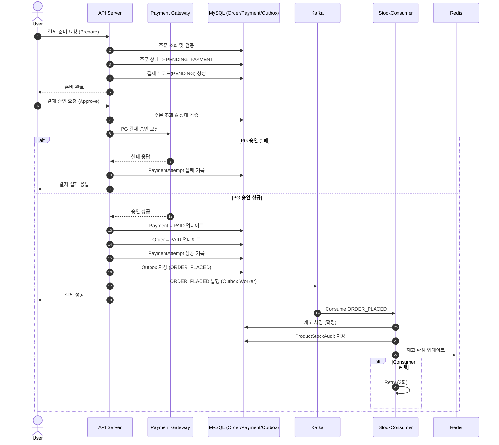

# 💳 결제 승인

결제는 Prepare → Approve 2단계로 처리되며,  
Approve 단계에서는 DB 트랜잭션 + Outbox 패턴으로  
결제/주문 상태 업데이트와 재고 확정을 일관성 있게 처리합니다.

---

```mermaid
sequenceDiagram
    autonumber
    actor User
    participant API as API Server
    participant PG as Payment Gateway
    participant DB as MySQL (Order/Payment/Outbox)
    participant Kafka as Kafka
    participant Consumer as StockConsumer
    participant Redis as Redis

    User->>API: 결제 준비 요청 (Prepare)
    API->>DB: 주문 조회 및 검증
    API->>DB: 주문 상태 -> PENDING_PAYMENT
    API->>DB: 결제 레코드(PENDING) 생성
    API-->>User: 준비 완료

    User->>API: 결제 승인 요청 (Approve)
    API->>DB: 주문 조회 & 상태 검증
    API->>PG: PG 결제 승인 요청

    alt PG 승인 실패
        PG-->>API: 실패 응답
        API->>DB: PaymentAttempt 실패 기록
        API-->>User: 결제 실패 응답
    else PG 승인 성공
        PG-->>API: 승인 성공

        API->>DB: Payment = PAID 업데이트
        API->>DB: Order = PAID 업데이트
        API->>DB: PaymentAttempt 성공 기록
        API->>DB: Outbox 저장 (ORDER_PLACED)

        API->>Kafka: ORDER_PLACED 발행 (Outbox Worker)
        API-->>User: 결제 성공

        Kafka->>Consumer: Consume ORDER_PLACED
        Consumer->>DB: 재고 차감 (확정)
        Consumer->>DB: ProductStockAudit 저장
        Consumer->>Redis: 재고 확정 업데이트

        alt Consumer 실패
            Consumer->>Consumer: Retry (3회)
        end
    end

```

